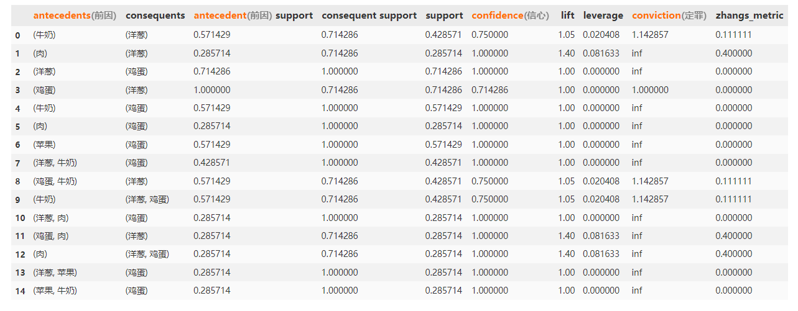

## 关联性分析

数据挖掘中的关联分析是一种用于发现数据集中不同项之间的关联关系的方法。关联分析通常用于在大规模数据集中发现频繁项集和关联规则。总的来说，关联规则通过量化的数字决定某物品甲对物品乙的出现有多大的影响。该模式属于描述性模式，属于**`无监督学习`**的方法

下面是几种常见的关联分析方法及其详细解释：

1. **频繁项集挖掘（Frequent Itemset Mining）**：频繁项集是指在数据集中同时出现的项的集合。频繁项集挖掘的目标是找到在数据集中出现频率高于预定义阈值的项集。常用的频繁项集挖掘算法包括Apriori算法和FP-Growth算法。

2. **关联规则挖掘（Association Rule Mining）**：关联规则是指项集之间的条件关系，例如"A->B"表示项集A出现时，项集B也可能出现。关联规则挖掘的目标是从频繁项集中找到具有一定置信度的关联规则。关联规则通常使用支持度和置信度来衡量规则的重要性。常用的关联规则挖掘算法包括Apriori算法和FP-Growth算法。

3. **序列模式挖掘（Sequential Pattern Mining）**：序列模式是指在时间序列数据中出现的一系列项的序列。序列模式挖掘的目标是发现在时间序列数据中频繁出现的序列模式。序列模式挖掘算法需要考虑项的出现顺序和时间跨度，常用的算法包括GSP（Generalized Sequential Pattern）算法和PrefixSpan算法。

4. **关联网络分析（Association Network Analysis）**：关联网络分析是通过构建关联网络来分析数据集中的关联关系。关联网络由节点和边组成，其中节点代表项集，边代表项集之间的关联关系。关联网络分析可以帮助识别关键节点和关联子图，从而揭示数据集的结构和关联模式。

5. **多层次关联分析（Multilevel Association Analysis）**：多层次关联分析是一种用于发现数据集中多个层次的关联关系的方法。它可以在不同的抽象层次上进行关联分析，从而揭示数据集中的多个关联模式。多层次关联分析可以通过层次划分、多层次关联规则和多层次关联网络来实现。

这些关联分析方法在数据挖掘中被广泛应用，可以帮助发现数据集中的隐含关系和模式，提供有价值的洞察和决策支持。根据具体的应用场景和数据特点，选择适合的关联分析方法进行数据挖掘分析。

下面是常用的关联规则算法的详细解释、优缺点以及以Markdown表格格式给出的总结：

| 算法名称           | 算法描述                                                     | 优缺点                                                       |
| ------------------ | ------------------------------------------------------------ | ------------------------------------------------------------ |
| Apriori算法        | 基于频繁项集的挖掘算法。通过迭代生成候选项集，并利用候选项集的频率计算支持度，从而找到频繁项集。然后，使用频繁项集生成关联规则，并计算置信度。 | 优点：简单易懂，易于实现。 缺点：需要多次扫描数据集，计算复杂度较高；随着项集的增长，候选项集的数量呈指数级增加，导致算法效率较低。 |
| FP-Growth算法      | 使用频繁模式树（FP-Tree）的挖掘算法。首先构建FP-Tree，然后通过递归将FP-Tree划分为条件模式基，从而找到频繁项集。最后，使用频繁项集生成关联规则，并计算置信度。 | 优点：相对于Apriori算法，减少了多次扫描数据集的开销，提高了算法效率；对于大规模数据集，效果更好。 缺点：构建FP-Tree的过程可能需要占用较大的内存空间；在某些情况下，FP-Growth算法的性能可能略差于Apriori算法。 |
| ECLAT算法          | 基于垂直数据格式的挖掘算法。将事务数据转换为垂直格式，其中每个项与对应的事务列表相关联。通过递归搜索和交集操作，找到频繁项集。然后，使用频繁项集生成关联规则，并计算置信度。 | 优点：相对于Apriori算法，减少了候选项集的生成和扫描开销，提高了算法效率；对于稠密数据集，效果更好。 缺点：在稀疏数据集中，性能可能不如Apriori算法和FP-Growth算法。 |
| FPMax算法          | 一种寻找最大频繁项集的算法。与FP-Growth算法类似，但不生成所有频繁项集。首先找到频繁项集，然后通过计算每个频繁项集的闭包，将非最大频繁项集排除。 | 优点：相对于FP-Growth算法，减少了频繁项集的生成和存储开销，提高了算法效率；仅保留最大频繁项集，减少了关联规则的数量，提高了结果的可解释性。 缺点：对于频繁项集较多或具有很大差异的数据集，性能可能不如FP-Growth算法。 |
| Direct Hashing算法 | 一种基于哈希表的挖掘算法。通过构建候选项集哈希表和事务哈希表，生成候选项集，并计算支持度。然后，通过哈希表的操作，找到频繁项集。最后，使用频繁项集生成关联规则，并计算置信度。 | 优点：对于稠密数据集和小规模数据集，效果较好；在一些特定情况下，算法性能可能优于其他算法。 缺点：对于稀疏数据集和大规模数据集，性能可能不如其他算法；哈希表的构建和操作可能占用于关联规则挖掘的常见算法有： |
| 灰色关联分析算法   | 灰色关联分析算法是一种用于处理灰色系统的分析方法。它通过将不确定的数据序列转化为确定的关联度序列，从而揭示因素之间的关联性和影响程度。算法的基本思想是通过计算序列数据的关联度，来评估不同因素对于系统演化的影响程度。灰色关联分析算法主要包括数据序列预处理、关联度计算和排序三个步骤。在关联度计算中，常用的方法有灰色关联度、绝对关联度和相对关联度等。灰色关联分析算法可以广泛应用于各种领域，如经济、环境、工程等。 | 优点：<br>- 能够处理不完整、不确定和不精确的数据，适用于灰色系统建模。<br>- 相对简单易用，计算速度较快。<br>- 能够揭示因素之间的关联性和影响程度，有助于分析决策和预测。<br>缺点：<br>- 对于数据的选择和预处理要求较高，需要根据具体问题进行合理的处理。<br>- 算法的结果受到数据质量和特征选择的影响，可能存在一定的主观性。<br>- 算法基于关联度的计算，对于高维数据或者复杂关系的分析可能存在局限性。 |

以上方法中实现较好的为Apriori算法，以及灰色关联分析算法。

### Apriori 算法

>  Apriori算法的名称来源于拉丁语词汇"priori"，意为"在之前"或"在前面"。这个名称反映了Apriori算法的基本思想，即**通过先前的频繁项集来生成更大的候选项集**，并通过剪枝操作来减少搜索空间。
>
>  该算法最早由R.Agrawal和R.Srikant在1994年的论文《Fast Algorithms for Mining Association Rules》中提出。在该论文中，作者提出了一种基于频繁项集的关联规则挖掘方法，其中的核心思想就是**利用"先验知识"（prior knowledge）来加速挖掘过程**。
>

下面详细介绍Apriori算法的步骤和数学推导：

1. 数据预处理：首先，需要对数据进行预处理，确保数据集的格式适用于Apriori算法。通常，数据集采用事务表示，每个事务由若干项组成，项可以是商品、产品或其他类型的数据。
  
2. 构建候选项集：根据预处理的数据集，首先生成所有可能的单个项集作为候选项集。对于大规模数据集，可以使用特殊的数据结构（如FP树）来加速候选项集的生成。

3. 计算候选项集的支持度：遍历数据集，统计每个候选项集在数据集中出现的次数，即候选项集的支持度。支持度表示项集在数据集中出现的频率。

4. 剪枝操作：根据设定的最小支持度阈值，将支持度低于阈值的候选项集剪枝，去除非频繁项集。这样可以减少后续步骤中的搜索空间。

5. 组合生成更大的候选项集：从频繁项集中生成新的候选项集。对于频繁项集Lk-1，将其两两组合生成候选项集Ck，其中k表示项集的大小。

6. 重复步骤3-5，直到无法生成更多的候选项集。

7. 生成关联规则：对于每个频繁项集，生成关联规则。关联规则的生成可以通过逐个项集的方式，或者通过递归方式生成更多的规则。

8. 计算置信度：计算每个关联规则的置信度。置信度表示规则的可信程度，即前项和后项同时出现的概率。

9. 根据设定的最小置信度阈值，筛选出满足置信度要求的关联规则。

10. 返回满足条件的关联规则作为挖掘结果。

   我们举一个实际例子来更好理解

   >  假设我们有以下数据集：
   >
   >  数据集：
   >  Transaction 1: {牛奶, 面包, 蛋}
   >  Transaction 2: {面包, 小麦, 橙汁}
   >  Transaction 3: {牛奶, 小麦, 蛋}
   >  Transaction 4: {面包, 牛奶, 小麦, 蛋}
   >  Transaction 5: {面包, 牛奶, 橙汁}
   >
   >  现在我们将按照Apriori算法的步骤进行求解：
   >
   >  步骤1：准备数据集
   >  数据集已经给定如上所示。
   >
   >  步骤2：确定最小支持度阈值
   >  假设我们选择最小支持度阈值为2，表示一个项目集在数据集中至少出现2次才被认为是频繁项集。
   >
   >  步骤3：生成候选项集
   >  初始候选项集包含单个项目，即C1 = {牛奶, 面包, 蛋, 小麦, 橙汁}。
   >
   >  步骤4：计算候选项集的支持度
   >  计算候选项集的支持度，统计每个候选项集在数据集中的出现次数。
   >
   >  C1的支持度计数：
   >  牛奶: 2
   >  面包: 4
   >  蛋: 2
   >  小麦: 3
   >  橙汁: 2
   >
   >  步骤5：筛选频繁项集
   >  根据最小支持度阈值，筛选出支持度大于或等于2的项集作为频繁项集。
   >
   >  L1 = {面包, 小麦}
   >
   >  步骤6：生成关联规则
   >  对于频繁项集L1，生成其所有可能的关联规则。
   >
   >  关联规则集R1 = {面包 -> 小麦, 小麦 -> 面包}
   >
   >  步骤7：计算关联规则的置信度
   >  计算关联规则的置信度，即计算规则的条件发生时，结论也发生的概率。
   >
   >  置信度计算：
   >  面包 -> 小麦：支持度(面包, 小麦) / 支持度(面包) = 3/4 = 0.75
   >  小麦 -> 面包：支持度(面包, 小麦) / 支持度(小麦) = 3/3 = 1.00
   >
   >  步骤8：筛选强关联规则
   >  根据设定的最小置信度阈值，筛选出置信度大于或等于0.7的关联规则作为强关联规则。
   >
   >  强关联规则集R1 = {面包 -> 小麦, 小麦 -> 面包}
   >
   >  通过以上步骤，我们完成了Apriori算法对给定数据集的求解。不过还有的是这里只展示两个

   此外得到的频繁项集中还有以下各项指标

   >  - `lift`（提升度）是关联规则分析中的一个度量，用于衡量两个事件之间的关联程度。它表示两个事件**同时发生的概率与它们各自独立发生的概率之比**。当提升度大于1时，**表示两个事件之间存在正向关联，即它们的出现是相互促进的**。当提升度等于1时，表示两个事件之间不存在关联。当提升度小于1时，表示两个事件之间存在负向关联，即它们的出现是相互抑制的。
   >
   >  - `leverage`（杠杆率）是关联规则分析中的另一个度量，用于衡量两个事件之间的关联程度。它表示**两个事件同时发生的概率**与**在假设它们是独立事件的情况下预期同时发生的概率之间的差异**。当杠杆率大于0时，表示两个事件之间存在正向关联。当杠杆率等于0时，表示两个事件之间不存在关联。当杠杆率小于0时，表示两个事件之间存在负向关联。
   >
   >  - `conviction`（确信度）是关联规则分析中的另一个度量，用于衡量规则的可靠性。它表示如果**前提事件发生，则导致结论事件不发生的概率**与**假设前提事件和结论事件是独立事件的情况下导致结论事件不发生的概率之比**。当确信度大于1时，表示前提事件对于导致结论事件的发生有积极影响。当确信度等于1时，表示前提事件对于导致结论事件的发生没有影响。当确信度小于1时，表示前提事件对于导致结论事件的发生具有负面影响。
   >
   >  - `zhangs_metric`（张氏度量）是关联规则分析中的另一个度量，用于衡量规则的置信度和支持度之间的关系。它的计算方式是将**置信度和支持度相乘后开方**。张氏度量的取值范围在0到1之间，值越接近1表示规则越强。
   >

   **经典案例**：
   我们将使用一个经典的数据集，称为"Groceries"，该数据集包含一段时间内超市顾客购买的物品清单。我们将使用Python中的mlxtend库来实现Apriori算法。

   数据集获取链接: https://www.kaggle.com/datasets/heeraldedhia/groceries-dataset  （Dataset of 38765 rows for Market Basket Analysis）

   

   最流行的是mlxtend包。mlxtend是一个Python库（`Machine Learning Extensions`)，旨在为机器学习领域提供额外的功能和扩展，以丰富机器学习工具箱，其中包括Apriori算法。

   下面是一个使用mlxtend库的模板代码：

   ````python
   from mlxtend.preprocessing import TransactionEncoder
   from mlxtend.frequent_patterns import apriori, association_rules
   import pandas as pd
   
   # 加载数据集(简单)
   dataset = [["牛奶", "洋葱", "鸡蛋"],
              ["洋葱", "肉", "鸡蛋", "香蕉"],
              ["牛奶", "苹果", "鸡蛋"],
              ["牛奶", "洋葱", "肉", "鸡蛋"],
              ["洋葱","苹果", "鸡蛋"],
              ["鸡蛋", "苹果"],
              ["洋葱", "牛奶", "苹果", "鸡蛋"]]
   
   # 处理数据
   # 读取数据集
   data = pd.read_csv('grocery_store.csv', header=None)
   
   # 数据预处理
   transactions = []
   for i in range(len(data)):
       transactions.append([str(data.values[i, j]) for j in range(len(data.columns))])
   # 根据同一名用户同一时间作为一行数据
   
      
   # 转换数据集为布尔矩阵
   te = TransactionEncoder()
   te_ary = te.fit(dataset).transform(dataset)
   df = pd.DataFrame(te_ary, columns=te.columns_)
   
   # 使用Apriori算法找出频繁项集
   frequent_itemsets = apriori(df, min_support=0.2, use_colnames=True)
   
    # 计算关联规则的置信度和支持度
     rules = association_rules(frequent_itemsets, metric="confidence", min_threshold=0.7)
   print(rules)



**不使用库的模板代码：**

```python
#-*- coding: utf-8 -*-
from __future__ import print_function
import pandas as pd

#自定义连接函数，用于实现L_{k-1}到C_k的连接
def connect_string(x, ms):
  x = list(map(lambda i:sorted(i.split(ms)), x))
  l = len(x[0])
  r = []
  for i in range(len(x)):
    for j in range(i,len(x)):
      if x[i][:l-1] == x[j][:l-1] and x[i][l-1] != x[j][l-1]:
        r.append(x[i][:l-1]+sorted([x[j][l-1],x[i][l-1]]))
  return r

#寻找关联规则的函数
def find_rule(d, support, confidence, ms = u'--'):
  result = pd.DataFrame(index=['support', 'confidence']) #定义输出结果
  
  support_series = 1.0*d.sum()/len(d) #支持度序列
  column = list(support_series[support_series > support].index) #初步根据支持度筛选
  k = 0
  
  while len(column) > 1:
    k = k+1
    print(u'\n正在进行第%s次搜索...' %k)
    column = connect_string(column, ms)
    print(u'数目：%s...' %len(column))
    sf = lambda i: d[i].prod(axis=1, numeric_only = True) #新一批支持度的计算函数
    
    #创建连接数据，这一步耗时、耗内存最严重。当数据集较大时，可以考虑并行运算优化。
    d_2 = pd.DataFrame(list(map(sf,column)), index = [ms.join(i) for i in column]).T
    
    support_series_2 = 1.0*d_2[[ms.join(i) for i in column]].sum()/len(d) #计算连接后的支持度
    column = list(support_series_2[support_series_2 > support].index) #新一轮支持度筛选
    support_series = support_series.append(support_series_2)
    column2 = []
    
    for i in column: #遍历可能的推理，如{A,B,C}究竟是A+B-->C还是B+C-->A还是C+A-->B？
      i = i.split(ms)
      for j in range(len(i)):
        column2.append(i[:j]+i[j+1:]+i[j:j+1])
    
    cofidence_series = pd.Series(index=[ms.join(i) for i in column2]) #定义置信度序列
 
    for i in column2: #计算置信度序列
      cofidence_series[ms.join(i)] = support_series[ms.join(sorted(i))]/support_series[ms.join(i[:len(i)-1])]
    
    for i in cofidence_series[cofidence_series > confidence].index: #置信度筛选
      result[i] = 0.0
      result[i]['confidence'] = cofidence_series[i]
      result[i]['support'] = support_series[ms.join(sorted(i.split(ms)))]
  
  result = result.T.sort_values(['confidence','support'], ascending = False) #结果整理，输出
  print(u'\n结果为：')
  print(result)
  
  return result

——————————————————————————————————————————————————————————————————————————————————————————
#-*- coding: utf-8 -*-
#使用Apriori算法挖掘菜品订单关联规则
from __future__ import print_function
import pandas as pd
from apriori import * #导入自行编写的apriori函数

inputfile = '../data/menu_orders.xls'
outputfile = '../tmp/apriori_rules.xls' #结果文件
#data = pd.read_excel(inputfile, header = None)
# 加载数据集(简单)
data = [["牛奶", "洋葱", "鸡蛋"],
           ["洋葱", "肉", "鸡蛋", "香蕉"],
           ["牛奶", "苹果", "鸡蛋"],
           ["牛奶", "洋葱", "肉", "鸡蛋"],
           ["洋葱","苹果", "鸡蛋"],
           ["鸡蛋", "苹果"],
           ["洋葱", "牛奶", "苹果", "鸡蛋"]]

print(u'\n转换原始数据至0-1矩阵...')
ct = lambda x : pd.Series(1, index = x[pd.notnull(x)]) #转换0-1矩阵的过渡函数
b = map(ct, data.as_matrix()) #用map方式执行
data = pd.DataFrame(list(b)).fillna(0) #实现矩阵转换，空值用0填充
print(u'\n转换完毕。')
del b #删除中间变量b，节省内存

support = 0.2 #最小支持度
confidence = 0.5 #最小置信度
ms = '---' #连接符，默认'--'，用来区分不同元素，如A--B。需要保证原始表格中不含有该字符

find_rule(data, support, confidence, ms).to_excel(outputfile) #保存结果
```

**相关学习资源：**

1. R. Agrawal, R. Srikant. [Fast algorithms for mining association rules](https://www.it.uu.se/edu/course/homepage/infoutv/ht08/vldb94_rj.pdf)  , 1994
2. mlxtend官方文档：http://rasbt.github.io/mlxtend/
3. Python数据分析与挖掘实战（朱明星 著）- 第12章 关联规则挖掘

### FP-Growth算法

FP-Growth（Frequent Pattern Growth）算法是一种用于高效挖掘频繁项集的关联规则算法。它通过构建FP树（Frequent Pattern Tree）来避免生成候选项集，从而减少了搜索空间，提高了算法的效率。下面是对FP-Growth算法的详细解释和数学公式推导。

**算法步骤：**

1. 构建项头表（Header Table）：遍历数据集，统计每个项的支持度，并按照支持度降序排序。构建一个项头表，每个项头表项包含项的名称、支持度计数和指向该项在FP树中第一个节点的指针。

2. 构建FP树：遍历数据集，对于每个事务，根据项头表中项的顺序构建FP树。对于每个事务中的项，从根节点开始，如果该项在当前节点的子节点中存在，则增加子节点的支持度计数；否则，创建一个新的子节点，并更新项头表中该项的链表。最后构建得到的树称为FP树。

3. 构建条件模式基：对于每个项头表中的项，从项头表链表的末尾开始，递归遍历该项的链表，生成以该项为后缀路径的条件模式基。每个条件模式基包含路径中除了当前项的其他项以及对应的支持度计数。

4. 递归挖掘FP树：对于每个项头表中的项，将它与条件模式基组合，形成新的频繁项集。如果条件模式基非空，则以条件模式基为输入递归调用FP树构建和挖掘过程。

**数学公式推导：**

假设我们有一个事务数据库D，其中每个事务T是一个项集。项集由项的集合表示，记作T={x1, x2, ..., xn}，其中xi是项的名称。

- `Support(X)`表示项集X在事务数据库D中的支持度，即项集X出现在事务数据库D中的事务数目。

FP-Growth算法通过构建FP树来挖掘频繁项集。FP树是一种紧凑的数据结构，用于存储事务数据库中的频繁项集。

- `FP Tree`：FP树是由树节点构成的数据结构，每个节点包含项的名称、支持度计数和指向同一项的其他节点的指针。每个节点的子节点表示项集的子集。

- `项头表`：项头表是FP树中的项的列表，每个项头表项包含项的名称、支持度计数和指向该项在FP树中第一个节点的指针。

FP-Growth算法的数学公式推导过程涉及到项头表、FP树的构建以及条件模式基的生成，这里给出了核心的公式推导步骤作为示例：

1. 构建项头表：

   - 项集的支持度计数：`Support(X)`，项集X在事务数据库D中的支持度。

2. 构建FP树：

   - 根据项头表中的项的顺序构建FP树，遍历事务数据库D中的每个事务T。
   - 对于每个事务T，根据项头表中的顺序，将项插入到FP树中的合适位置。
   - 如果项在当前节点的子节点中存在，则增加子节点的支持度计数；否则，创建一个新的子节点，并更新项头表中该项的链表。

3. 构建条件模式基：

   - 对于每个项头表中的项，从项头表链表的末尾开始，递归遍历该项的链表，生成以该项为后缀路径的条件模式基。
   - 每个条件模式基包含路径中除了当前项的其他项以及对应的支持度计数。

4. 递归挖掘FP树：

   - 对于每个项头表中的项，将它与条件模式基组合，形成新的频繁项集。
   - 如果条件模式基非空，则以条件模式基为输入递归调用FP树构建和挖掘过程。

这是FP-Growth算法的核心步骤和相关数学公式的推导过程。在实际应用中，还需要考虑对FP树的压缩和剪枝等优化技术来提高算法的效率。

**经典案例和代码实现：**

以下是一个使用Python的mlxtend库实现FP-Growth算法的示例代码：

```python
from mlxtend.frequent_patterns import fpgrowth
from mlxtend.preprocessing import TransactionEncoder
import pandas as pd

# 创建示例数据集
dataset = [['Milk', 'Eggs', 'Bread'],
           ['Milk', 'Butter'],
           ['Cheese', 'Bread', 'Butter'],
           ['Milk', 'Eggs', 'Bread', 'Butter'],
           ['Cheese', 'Bread', 'Butter']]

# 使用TransactionEncoder将数据集转换为布尔矩阵
te = TransactionEncoder()
te_ary = te.fit(dataset).transform(dataset)
df = pd.DataFrame(te_ary, columns=te.columns_)

# 使用fpgrowth函数查找频繁项集
frequent_itemsets = fpgrowth(df, min_support=0.2, use_colnames=True)

print(frequent_itemsets)
```

这里使用了mlxtend库中的`fpgrowth`函数来执行FP-Growth算法。首先，将事务数据集转换为布尔矩阵表示，然后调用`fpgrowth`函数来寻找指定最小支持度阈值的频繁项集。

另外，如果你想使用自己实现的FP-Growth算法，可以参考相关的开源实现和算法细节。以下是一些学习资源，可以帮助你更深入地了解FP-Growth算法：

1. Han, J., Pei, J., & Yin, Y. (2000). Mining frequent patterns without candidate generation. In Proceedings of the 2000 ACM SIGMOD international conference on Management of data (pp. 1-12).

2. Agrawal, R., Imieliński, T., & Swami, A. (1993). Mining association rules between sets of items in large databases. ACM SIGMOD Record, 22(2), 207-216.

3. mlxtend documentation: https://rasbt.github.io/mlxtend/

4. Python implementation of FP-Growth algorithm: https://github.com/evandempsey/fp-growth

###  灰色关联分析

> 灰色关联分析是一种数据分析方法，它主要用于研究某些因素之间的关联性。该方法最初由中国科学家徐凯发明，并在20世纪80年代得到了广泛应用。

灰色关联分析（Grey Relational Analysis，GRA）是一种常用的多因素评价方法，主要用于处理多个因素之间存在线性或非线性相关性的情况。GRA在实际应用中具有很强的可解释性和适应性，特别适用于小样本、高维度的决策问题。

> 为什么叫灰色？这是因为GRA最早是由中国科学家徐建华于1982年提出，并借鉴了灰色系统理论中的“灰色关联度”概念。所谓灰色关联度，是指在一定条件下，某两个对象之间的相似程度。在GRA中，将多个因素看作不同的对象，通过计算它们之间的灰色关联度，来评价它们之间的影响程度和相互关系。

具体地，GRA的步骤如下：

1. 数据预处理：根据实际问题选择合适的因素指标，并对数据进行标准化处理，使每个因素的取值范围相同。

2. 确定参考序列：将要评估的各因素与一个已知的参考序列进行比较，以确定它们之间的关联程度。这里需要选择一个合适的参考序列，通常选取其中排名靠前的因素作为参考序列。

3. 计算关联系数：将各因素与参考序列之间的差距进行标准化，得到一组灰色关联度数据。具体计算方法包括相关系数法、距离法、均值法等。

4. 确定权重：根据实际需求和专家经验，对各因素进行加权，得到最终权重向量。

5. 综合评价：将各因素的灰色关联度乘以它们的权重，并将结果累加，得到各个方案的综合评价值。评价值越大表示方案越优。

需要注意的是，在GRA中，不同因素之间的关系被看作是灰色的，即存在不确定性和模糊性。因此，在使用GRA时需要根据实际情况选择合适的计算方法和参数，并进行必要的灵活调整。

GRA的计算公式主要包括关联系数的计算和综合评价值的计算，下面分别介绍。

1. 关联系数的计算

在GRA中，常用的关联系数计算方法有三种：相关系数法、距离法和均值法。这里以相关系数法为例进行说明。

（1）将原始数据进行标准化处理，即将各因素的数据范围缩放到0~1之间。

（2）设原始数据矩阵为$X_{m\times n}$，参考序列矩阵为$Y_{1\times n}$，则各因素与参考序列之间的关联系数$\rho_i(i=1,2,\dots,m)$可以通过计算它们的相关系数得到：

$$\rho_i=\frac{\sum_{j=1}^n(x_{ij}-\overline{x_i})(y_j-\overline{y})}{\sqrt{\sum_{j=1}^n(x_{ij}-\overline{x_i})^2}\sqrt{\sum_{j=1}^n(y_j-\overline{y})^2}}$$

其中，$\overline{x_i}$和$\overline{y}$分别表示第$i$个因素和参考序列的平均值。

（3）对于非线性相关性问题，也可以使用其他关联系数计算方法，如距离法和均值法。距离法中常用的是欧氏距离和曼哈顿距离，均值法中常用的是夹角余弦和广义平均值等方法。

2. 综合评价值的计算

将各因素的关联系数乘以它们的权重，并将结果累加，即可得到各个方案的综合评价值。设第$i$个方案的综合评价值为$S_i$，则：

$$S_i=\sum_{j=1}^m w_j\rho_{ij}$$

其中，$w_j$表示第$j$个因素的权重。

需要注意的是，在实际应用中，权重的确定可能涉及主观和客观因素的综合考虑，可以采用层次分析法、模糊综合评判法等方法进行处理。

总之，灰色关联分析是一种可靠的多因素评价方法，可以用于处理多个因素之间的线性或非线性相关性问题。通过计算各因素之间的灰色关联度，并结合权重和参考序列，可以得到比较客观、全面的综合评价结果，有助于帮助决策者做出更好的决策。这种方法在经济、环保、医疗等领域都有广泛应用。

> 灰色关联分析主要属于数学领域，它是一种基于数学理论的数据分析方法。虽然灰色关联分析和机器学习在某些方面有些相似之处，例如都需要对数据进行处理、计算等，但两者的研究目的和方法还是有很大不同的。机器学习更多地关注如何通过算法来让计算机自动地从数据中学习，并做出预测或决策，而灰色关联分析则更多地着眼于研究不同因素之间的关联性，并用数值来量化这种关联性的强度。

进行数据的差异性分析是为了了解不同组之间或不同时间点之间的差异。下面是一些下手的步骤：

1. 确定差异性分析的目的：首先，明确你对数据差异性的具体研究问题和目标。你可能想要了解不同组之间的差异、不同时间点之间的变化，或者寻找与特定因素相关的差异性。
2. 数据准备：对数据进行清洗和整理，确保数据的完整性和准确性。如果需要，进行缺失值处理、异常值处理或数据转换等操作。
3. 描述性统计分析：使用适当的统计方法对数据进行描述性统计分析。这将帮助你了解数据的基本特征，例如均值、标准差、分布等。
4. 可视化分析：使用适当的图表和可视化工具来展示数据的差异性。常用的可视化方法包括条形图、箱线图、散点图等。这些图表可以帮助你观察和比较不同组或时间点之间的差异。
5. 统计检验：使用适当的统计检验方法来评估差异的显著性。常用的统计检验方法包括t检验、方差分析（ANOVA）、卡方检验等。这些方法可以帮助你确定差异是否具有统计学意义。

>  确定使用哪种检验方法来分析数据的差异性分析通常涉及以下几个步骤：
>
>  1. 确定数据类型：首先，确定你的数据是连续型数据还是分类型数据。连续型数据是以数字形式表示的，例如身高、体重等；而分类型数据是以类别形式表示的，例如性别、地区等。
>
>  2. 确定差异性的性质：确定你想要分析的差异性是两组之间的差异，还是多组之间的差异。如果是两组之间的差异，那么你需要选择两样本之间的差异性检验方法；如果是多组之间的差异，那么你需要选择多样本之间的差异性检验方法。
>
>  3. 根据数据类型和差异性的性质选择适当的检验方法：根据数据类型和差异性的性质，选择适当的差异性检验方法。以下是一些常见的差异性检验方法：
>
>     - 对于连续型数据的两组差异性分析，可以使用t检验（独立样本t检验或配对样本t检验）。
>     - 对于连续型数据的多组差异性分析，可以使用方差分析（ANOVA），例如单因素方差分析或多因素方差分析。
>     - 对于分类型数据的两组差异性分析，可以使用卡方检验或Fisher精确检验。
>     - 对于分类型数据的多组差异性分析，可以使用卡方检验或Fisher精确检验的扩展方法，例如多重比较或列联表分析。
>
>  4. 确定检验的前提条件：每种差异性检验方法都有其前提条件，例如数据的正态性、方差齐性等。在选择检验方法之前，确保你的数据满足相应的前提条件。
>
>  5. 解读结果：根据检验的结果，对差异性进行解释和解读。确定是否存在统计上显著的差异，并根据结果提出进一步的研究问题或建议。
>
>  需要注意的是，以上只是一些常见的差异性检验方法，具体选择哪种方法还要根据你的具体情况和研究问题来决定。如果你不确定应该选择哪种方法，可以咨询统计学专家或参考相关的统计学和数据分析文献。

1. 结果解释：根据分析结果，对差异进行解释和解读。你可以探索数据背后的原因，并提出进一步的研究问题或建议。

需要注意的是，差异性分析的具体方法和步骤可能因数据类型、研究问题和分析目的的不同而有所不同。因此，在进行差异性分析之前，最好根据具体情况选择适当的方法和工具，并参考相关的统计学和数据分析文献。

