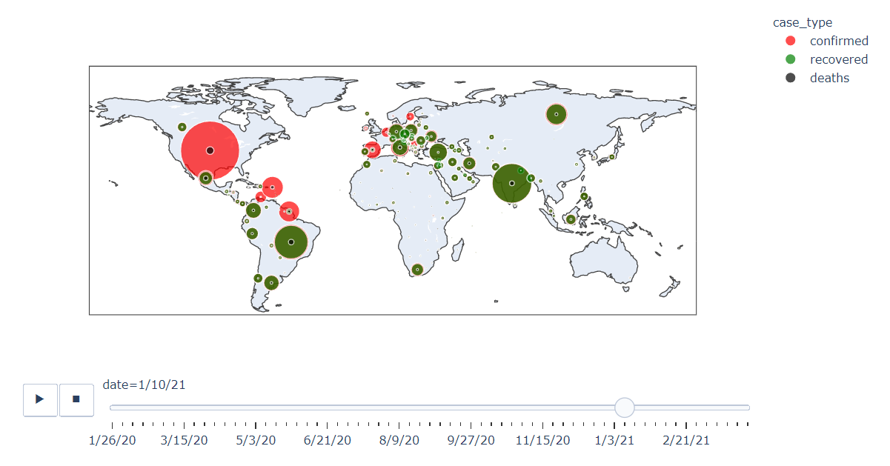
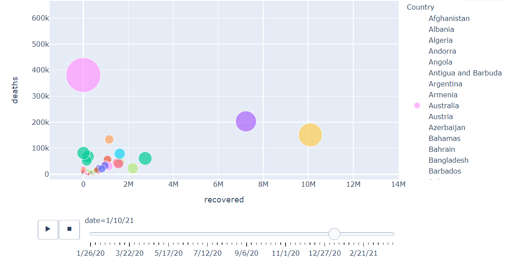

## 时间序列可视化方案

### 自相关图可视化

### 偏自相关图可视化


### 气泡图

项目：https://www.heywhale.com/mw/project/64157f8ebcd20b0330b935f2

plotly 实现

气泡图（Bubble Chart）是一种数据可视化图表，通常用于展示三个维度的数据。它类似于散点图（Scatter Plot），但在气泡图中，除了横轴和纵轴表示两个维度外，还使用气泡的大小或颜色来表示第三个维度的数据。(特别适合时间序列的数据)

气泡图的优点在于能够同时展示多个维度的数据，通过**气泡的大小和颜色**，可以更直观地观察和比较不同数据点之间的差异。然而，气泡图在数据点较多时可能会变得拥挤，难以解读。因此，在使用气泡图时，需要注意选择合适的数据集和调整气泡的大小和颜色的映射方式，以确保图表的可读性和有效传达数据信息。

```python
import pandas as pd

# 示例数据
data = {
    'Country': ['China', 'India', 'USA', 'Brazil'],
    'Lat': [39.90, 20.59, 37.09, -14.24],
    'Long': [116.40, 78.96, -95.71, -51.92],
    'value': [100, 200, 150, 120],
    'date': ['2021-01-01', '2021-02-01', '2021-03-01', '2021-04-01'],
    'case_type': ['A', 'B', 'C', 'A']
}

# 创建DataFrame
total_loc = pd.DataFrame(data)

# 绘制气泡图
fig = px.scatter_geo(
    total_loc,
    lat='Lat',
    lon='Long',
    size='value',
    size_max=50,
    animation_frame='date',
    color='case_type',
    color_discrete_sequence=['Red', 'Green', 'Black'],
    hover_name='Country'
)

fig.show()
```






>  `matplotlib`
>
>  ```python
>  import matplotlib.pyplot as plt
>  import numpy as np
>  
>  # 准备示例数据
>  x = np.random.rand(50)  # x轴坐标
>  y = np.random.rand(50)  # y轴坐标
>  sizes = np.random.rand(50) * 100  # 气泡大小
>  colors = np.random.rand(50)  # 气泡颜色
>  
>  # 创建气泡图
>  plt.scatter(x, y, s=sizes, c=colors, alpha=0.7)
>  
>  # 设置图表标题和坐标轴标签
>  plt.title('Bubble Chart')
>  plt.xlabel('X')
>  plt.ylabel('Y')
>  
>  # 显示图形
>  plt.show()
>  ```
