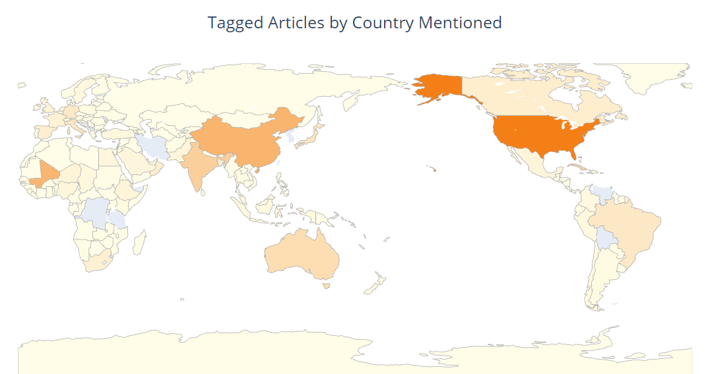

### World-map 可视化（地图_地点）

使用轻量级sqlite 数据库存储数据实现，并使用pandas.read_query_data读取

https://www.kaggle.com/code/davidmezzetti/cord-19-analysis-with-sentence-embeddings/notebook

```python
# Workaround for mdv terminal width issue
os.environ["COLUMNS"] = "80"

from paperai.highlights import Highlights
from txtai.pipeline import Tokenizer

from nltk.corpus import stopwords

import matplotlib.pyplot as plt
import numpy as np
import plotly.graph_objects as go
import pycountry

# Use paperai + NLTK stop words
STOPWORDS = Highlights.STOP_WORDS | set(stopwords.words("english"))

# Tokenizes text and removes stopwords
def tokenize(text, case_sensitive=False):
    # Get list of accepted tokens
    tokens = [token for token in Tokenizer.tokenize(text) if token not in STOPWORDS]
    
    if case_sensitive:
        # Filter original tokens to preserve token casing
        return [token for token in text.split() if token.lower() in tokens]

    return tokens
    
# Country data
countries = [c.name for c in pycountry.countries]
countries = countries + ["USA"]

# Lookup country name for alpha code. If already an alpha code, return value
def countryname(x):
    country = pycountry.countries.get(alpha_3=x)
    return country.name if country else x
    
# Resolve alpha code for country name
def countrycode(x):
    return pycountry.countries.get(name=x).alpha_3

# Tokenize and filter only country names
def countrynames(x):
    return [countryname(country) for country in countries if country.lower() in x.lower()]

import pandas as pd
import sqlite3
# Connect to database
db = sqlite3.connect("cord19q/articles.sqlite")

sections = pd.read_sql_query("select text from sections where tags is not null order by id desc LIMIT 500000", db)

# Filter tokens to only country names. Build dataframe of Country, Count, Code
mentions = pd.Series(np.concatenate([countrynames(x) for x in sections.Text])).value_counts()
mentions = mentions.rename_axis("Country").reset_index(name="Count")
mentions["Code"] = [countrycode(x) for x in mentions["Country"]]

# Set max to 5000 to allow shading for multiple countries
mentions["Count"] = mentions["Count"].clip(upper=5000)

mapplot(mentions, "Tagged Articles by Country Mentioned", "Articles by Country")
```




### 气泡图（三个维度）

项目：https://www.heywhale.com/mw/project/64157f8ebcd20b0330b935f2

plotly 实现

气泡图（Bubble Chart）是一种数据可视化图表，通常用于展示三个维度的数据。它类似于散点图（Scatter Plot），但在气泡图中，除了横轴和纵轴表示两个维度外，还使用气泡的大小或颜色来表示第三个维度的数据。(特别适合时间序列的数据)

气泡图的优点在于能够同时展示多个维度的数据，通过**气泡的大小和颜色**，可以更直观地观察和比较不同数据点之间的差异。然而，气泡图在数据点较多时可能会变得拥挤，难以解读。因此，在使用气泡图时，需要注意选择合适的数据集和调整气泡的大小和颜色的映射方式，以确保图表的可读性和有效传达数据信息。

```python
import pandas as pd

# 示例数据
data = {
    'Country': ['China', 'India', 'USA', 'Brazil'],
    'Lat': [39.90, 20.59, 37.09, -14.24],
    'Long': [116.40, 78.96, -95.71, -51.92],
    'value': [100, 200, 150, 120],
    'date': ['2021-01-01', '2021-02-01', '2021-03-01', '2021-04-01'],
    'case_type': ['A', 'B', 'C', 'A']
}

# 创建DataFrame
total_loc = pd.DataFrame(data)

# 绘制气泡图
fig = px.scatter_geo(
    total_loc,
    lat='Lat',
    lon='Long',
    size='value',
    size_max=50,
    animation_frame='date',
    color='case_type',
    color_discrete_sequence=['Red', 'Green', 'Black'],
    hover_name='Country'
)

fig.show()
```


>  `matplotlib`
>
>  ```python
>  import matplotlib.pyplot as plt
>  import numpy as np
>  
>  # 准备示例数据
>  x = np.random.rand(50)  # x轴坐标
>  y = np.random.rand(50)  # y轴坐标
>  sizes = np.random.rand(50) * 100  # 气泡大小
>  colors = np.random.rand(50)  # 气泡颜色
>  
>  # 创建气泡图
>  plt.scatter(x, y, s=sizes, c=colors, alpha=0.7)
>  
>  # 设置图表标题和坐标轴标签
>  plt.title('Bubble Chart')
>  plt.xlabel('X')
>  plt.ylabel('Y')
>  
>  # 显示图形
>  plt.show()
>  ```

