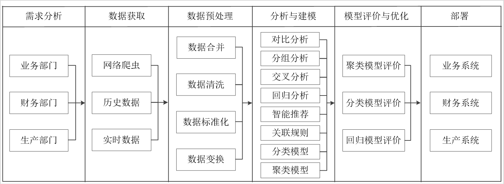

### 数据分析核心流程

**广义的数据分析包括狭义数据分析和数据挖掘。**

-  狭义的数据分析是指**根据分析目的**，采用`对比分析、分组分析、交叉分析和回归分析等分析方法`，对收集来的数据进行处理与分析，提取有价值的信息，发挥数据的作用，得到一个**特征统计量结果**的过程。
-  数据挖掘则是从大量的、不完全的、有噪声的、模糊的、随机的实际应用数据中，通过应用聚类、分类、回归和关联规则等技术，**挖掘潜在价值**的过程。


完整得数据分析流程如下图：



1.  确定需求（这很重要决定了后续的分析的方法和方向，多个部门，业务，财务，生产），建立数据链路（物联网实时、历史、爬虫）。
2.  数据读取与描述性统计（了解整体数据）
3.  数据清洗（数据一致性、无效值，异常值，重复值以及缺失值的处理，数据标准化，数据变换分解...)
4.  数据规约（删除无用数据列或建立数据列，重采样 或 离散化&连续化（以年月日重采样，或连续数据化为区间标签），数据聚合，属性规约，）
5.  **狭义数据分析**：数据可视化分析 & 数据检验，数据相关性分析、对比分析... (指标统计量)  - 提取有价值信息
6.  **数据挖掘**：提取特征（特征工程），并根据数据和需求进行分类、聚类、关联性、预测、回归... 并根据评价指标进行性能优化（模型或规则）- 提取潜在信息
7.  将通过了正式应用数据分析结果与结论应用至实际生产系统（微服务部署或分析报告汇报）

### 数据分析应用场景及其最佳实践

 企业使用数据分析解决不同的问题，实际应用的数据分析场景主要分为以下7类。

#### 客户分析(CustomerAnalytics)

客户分析主要是根据客户的基本数据信息进行商业行为分析，首先界定目标客户，根据客户的需求、目标客户的性质、所处行业的特征以及客户的经济状况等基本信息，使用统计分析方法和预测验证法分析目标客户，提高销售效率。其次了解客户的采购过程，根据客户采购类型、采购性质进行分类分析，制定不同的营销策略。最后还可以根据已有的客户特征进行客户特征分析、客户忠诚度分析、客户注意力分析、客户营销分析和客户收益分析。通过有效的客户分析能够掌握客户的具体行为特征，将客户细分，使得运营策略达到最优，提升企业整体效益等

#### 营销分析(Sales and Marketing Analytics）

营销分析囊括了产品分析、价格分析、渠道分析、广告与促销分析这4类分析。产品分析主要是竞争产品分析，通过对竞争产品的分析制定自身产品策略。价格分析又可以分为成本分析和售价分析。成本分析的目的是降低不必要的成本;售价分析的目的是制定符合市场的价格。渠道分析是指对产品的销售渠道进行分析，确定最优的渠道配比。广告与促销分析则能够结合客户分析，实现销量的提升、利润的增加。

#### 社交媒体分析(Social MediaAnalytics )
社交媒体分析是以不同的社交媒体渠道生成的内容为基础，实现不同社交媒体的用户分析、访问分析和互动分析等。用户分析主要根据用户注册信息、登录平台的时间点和平时发表的内容等用户数据，分析用户个人画像和行为特征:访问分析则是通过用户平时访问的内容分析用户的兴趣爱好，进而分析潜在的商业价值;互动分析根据互相关注对象的行为预测该对象未来的某此行为特征。同时，社交媒体分析还能为情感和舆情监督提供丰富的资料。	

#### 网络安全(Cyber Security)

大规模网络安全事件的发生，例如2017年5月席卷全球的 WannaCry病毒，让企业意识到网络攻击发生时预先快速识别的重要性。传统的网络安全主要依靠静态防御，处理病毒的主要流程是发现威胁、分析威胁和处理威胁。这种情况下，往往在威胁发生以后才能做出反应。新型的病毒防御系统可使用数据分析技术，建立潜在攻击识别分析模型，监测大量网络活动数据和相应的访问行为，识别可能进行入侵的可疑模式，做到未雨绸缪。

#### 设备管理(Plant and Facility Management)

设备管理同样是企业关注的重点。设备维修一般采用标准修理法、定期修理法和检查后修理法等方法。其中，标准修理法可能会造成设备过剩修理，修理费用高;检查后修理法解决了修理费用成本问题，但是修理前的准备工作繁多，设备的停歇时间过长。目前企业能够通过物联网技术收集和分析设备上的数据流，包括连续用电、零部件温度、环境湿度和污染物颗粒等多种潜在特征，建立设备管理模型，从而预测设备故障，合理安排预防性的维护，以确保设备正常作业，降低因设备故障带来的安全风险。

#### 交通物流分析(Transport and Logistics Analytics )

物流是物品从供应地向接收地的实体流动，是将运输、储存、装卸搬运、包装、流通加工、配送和信息处理等功能有机结合起来而实现用户要求的过程。用户可以通过业务系统和GPS 定位系统获得数据，使用数据构建交通状况预测分析模型，有效预测实时路况物流状况、车流量、客流量和货物吞吐量，进而提前补货，制定库存管理策略。

#### 欺诈行为检测(Fraud Detection )

身份信息泄露及盗用事件逐年增长，随之而来的是欺诈行为和交易的增多。公安机关各大金融机构、电信部门可利用用户基本信息、用户交易信息和用户通话短信信息等数据识别可能发生的潜在欺诈交易，做到提前预防、未雨绸缪。以大型金融机构为例，通过分类模型分析方法对非法集资和洗钱的逻辑路径进行分析，找到其行为特征。聚类模型分析方法可以分析相似价格的运动模式。例如对股票进行聚类，可能发现关联交易及内幕交易的可疑信息。关联规则分析方法可以监控多个用户的关联交易行为，为发现跨账号协同的金融诈骗行为提供依据。

### 数据质量分析（读取）

以下是一些常见的数据质量分析算法及其介绍、优缺点的示例表格：

| 算法名称                                       | 介绍                                                         | 优缺点                                                       |
| ---------------------------------------------- | ------------------------------------------------------------ | ------------------------------------------------------------ |
| 述性统计分析 (Descriptive Statistics Analysis) | 描述性统计分析是通过计算和汇总数据的基本统计指标来描述数据的特征。这些统计指标包括均值、中位数、标准差、最小值、最大值、百分位数等。描述性统计分析提供了关于数据分布、集中趋势和变异程度的信息。 | 优点：提供了对数据的基本理解和总结，可以帮助发现数据中的异常情况和问题。 缺点：仅提供了数据的概括性信息，可能无法捕捉到数据中的细节和复杂关系。 |
| 缺失值分析 (Missing Value Analysis)            | 用于检测和处理数据中的缺失值。它可以帮助确定缺失值的模式和原因，并选择适当的处理方法，如删除、插值或填充缺失值。 | 优点：可以帮助恢复丢失的数据，提高数据完整性。 缺点：对于大量缺失值的数据，处理方法可能会引入误差。 |
| 异常值检测 (Outlier Detection)                 | 用于识别数据中的异常值或离群值。这些异常值可能是由于测量错误、数据录入错误或其他异常情况引起的。异常值检测可以帮助发现数据中的问题并采取适当的措施。 | 优点：可以帮助发现数据质量问题，避免异常值对后续分析的影响。 缺点：可能会将正常但罕见的观测值误分类为异常值。 |
| 一致性分析 (Consistency Analysis)              | 用于评估数据中的一致性或冲突。它可以帮助发现数据中的不一致之处，例如相同实体的不同表达方式或不一致的属性值。一致性分析可以帮助清理和整理数据，使其更加一致和可靠。 | 优点：可以发现数据中的不一致性问题，提高数据的一致性和可信度。 缺点：可能需要复杂的规则和算法来检测一致性问题。 |
| 数据重复性分析 (Data Deduplication)            | 用于检测和处理数据中的重复记录。数据重复性分析可以帮助识别和删除重复的数据，以确保数据的唯一性和一致性。 | 优点：可以提高数据的准确性和一致性，减少重复数据对分析的影响。 缺点：可能需要消耗大量的计算资源和时间，特别是对于大型数据集。 |
| 数据验证 (Data Validation)                     | 用于验证数据是否符合预期的格式、范围或规则。数据验证可以帮助发现数据中的错误或异常，并提供数据质量报告。 | 优点：可以帮助发现数据中的错误或异常，提高数据的准确性和可靠性。 缺点：可能需要定义和实施复杂的验证规则和算法。 |

#### 描述性统计分析

##### 数值型描述性统计分析

下面是描述性统计分析中常用的分析算法

| 名称                                           | 介绍                                                         | 优缺点                                                       |
| ---------------------------------------------- | ------------------------------------------------------------ | ------------------------------------------------------------ |
| 频数分析<br>(Frequency Analysis)               | 频数分析是一种统计方法，用于计算和展示数据中不同值或取值范围的出现次数。它通常用于描述离散变量的分布情况。通过统计每个取值出现的频数，可以揭示数据的分布特征和重要特点。 | 优点：<br>1. 提供了对数据的直观了解，可以揭示数据的分布情况。<br>2. 对于离散数据，频数分析是一种简单有效的描述方式。<br>缺点：<br>1. 仅提供了关于频数的信息，忽略了其他统计量的分析。<br>2. 不适用于连续变量或大量取值的离散变量。 |
| 集中趋势分析<br>(Measures of Central Tendency) | 集中趋势分析用于描述数据的中心位置或平均水平。常用的集中趋势分析方法包括平均数、中位数和众数。这些方法可以帮助了解数据的典型值和分布特征。 | 优点：<br>1. 提供了对数据集中程度的度量，有助于了解数据的核心特征。<br>2. 简单易懂，计算方法直观。<br>缺点：<br>1. 平均数容易受到极端值的影响，不适合用于偏态分布的数据。<br>2. 中位数和众数无法提供关于数据分布的详细信息。 |
| 离散程度分析<br>(Measures of Dispersion)       | 离散程度分析用于衡量数据的离散程度或变异程度。常用的离散程度分析方法包括范围、方差和标准差等。这些方法可以帮助判断数据的分散程度和变异程度。 | 优点：<br>1. 提供了关于数据分散程度的度量，有助于了解数据的变异程度。<br>2. 可以用于比较不同数据集之间的离散程度。<br>缺点：<br>1. 范围只考虑了最大值和最小值，忽略了其他数据点的信息。<br>2. 方差和标准差可能受到极端值的影响，不适合用于偏态分布的数据。 |

以下则是各个统计量的表格


| 名称                        | 介绍                                                         | 特点                                                       |
| --------------------------- | ------------------------------------------------------------ | ---------------------------------------------------------- |
| 平均值 (Mean)               | 数据集中所有观测值的算术平均值。                             | 受极端值的影响较大，对异常值敏感。                         |
| 中位数 (Median)             | 数据集中按大小排列的中间值。                                 | 不受极端值的影响，对异常值较为稳健。                       |
| 众数 (Mode)                 | 数据集中出现频率最高的值。                                   | 可能存在多个众数或无众数。                                 |
| 方差 (Variance)             | 观测值与其平均值之差的平方的平均值。衡量数据的离散程度。     | 平方单位与原始数据单位不同，对极端值敏感。                 |
| 标准差 (Standard Deviation) | 方差的平方根。衡量数据的离散程度。                           | 与原始数据处于同一单位，对极端值敏感。                     |
| 百分位数 (Percentile)       | 数据集中特定百分比位置的值。                                 | 可以衡量数据的分布情况，如中位数是百分位数的一种特殊情况。 |
| 最小值 (Minimum)            | 数据集中的最小值。                                           | 描述数据集的最小观测值。                                   |
| 最大值 (Maximum)            | 数据集中的最大值。                                           | 描述数据集的最大观测值。                                   |
| 范围 (Range)                | 最大值与最小值之间的差。                                     | 衡量数据的变异范围。                                       |
| 四分位数 (Quartiles)        | 数据集被划分为四个等分的值。                                 | 可以衡量数据的分布情况，如中位数是四分位数的一种特殊情况。 |
| 偏度（Skewness）            | 偏度是描述概率分布偏斜程度的统计量。它测量了数据分布的不对称性。当偏度值为0时，数据分布是对称的；当偏度值大于0时，数据分布向右偏斜（正偏态）；当偏度值小于0时，数据分布向左偏斜（负偏态）。 | 偏度是对称性的一种度量，它可以帮助我们了解数据分布的形状。 |
| 峰度（Kurtosis）            | 峰度是描述概率分布尖峰或平坦程度的统计量。它度量了数据分布相对于正态分布的尖峰或平坦程度。正态分布的峰度为3。当峰度值大于3时，数据分布比正态分布更尖峭（尖峰态）；当峰度值小于3时，数据分布比正态分布更平坦（平峰态） | 峰度可以帮助我们判断数据分布的尖峰程度和离散程度。         |

以下则是用于输出数据质量分析的自定义代码：

```python
# 自定义analysis函数，实现数据信息探索的描述性统计分析和缺失值分析
def analysis(data):
    # 计算偏度和峰度
    skewness = data.skew()
    kurt = data.kurtosis()
    description = data.describe()
    description.loc['skewness'] = skewness
    description.loc['kurtosis'] = kurt
    # 计算每一列的重复值个数
    duplicates = data.duplicated().sum()
    duplicates_by_column = data.apply(lambda x: x.duplicated().sum()) # each
    print('数据相关信息：\n', data.info())
    print('描述性统计分析结果为：\n', description.T)
    print('各属性缺失值占比为：\n', 100*s(data.isnull().sum() / len(data)))
    print('\n 全部重复值个数: {} ,占比： {}'.format(duplicates,100*(duplicates / len(data))))
    print('各属性重复值占比为：\n', 100*(duplicates_by_column / len(data))) # 注意此时重复值很多需考虑真实场景
```

##### 类别型描述性统计分析


#### 数据检验

| 名称                                   | 介绍                                                         | 优缺点                                                       |
| -------------------------------------- | ------------------------------------------------------------ | ------------------------------------------------------------ |
| 正态性检验 (Normality Test)            | 正态性检验用于确定数据是否符合正态分布。常用的正态性检验方法包括Kolmogorov-Smirnov检验、Shapiro-Wilk检验和Anderson-Darling检验等。 | 优点：可以帮助确定数据是否适合使用基于正态分布的统计方法。缺点：对于大样本数据，即使微小的偏差也可能导致拒绝正态性假设。 |
| 异常值检测 (Outlier Detection)         | 异常值检测用于识别在数据集中具有异常特征的数据点。常用的异常值检测方法包括基于统计学的Z-score方法、**3σ原则**、**箱线图**方法和**基于距离的方法（如DBSCAN）**。 | 优点：可以帮助识别异常值，对于数据清洗和异常数据处理很有用。缺点：某些方法对于多维数据和高维数据的处理较为困难。 |
| 相关性检验 (Correlation Test)          | 相关性检验用于确定两个变量之间的相关性。常用的相关性检验方法包括`Pearson`相关系数、`Spearman`等级相关系数和`Kendall`秩相关系数。(该检验算法只能用于数值型，而不能用于类别型) | 优点：可以衡量变量之间的线性或非线性关系。缺点：相关性并不能说明因果关系，只是指示变量之间的关联程度。 |
| 方差分析 (Analysis of Variance, ANOVA) | 方差分析用于比较两个或多个组之间的均值是否有显著差异。常用的方差分析方法包括单因素方差分析和多因素方差分析。 | 优点：适用于比较多个组之间的差异，提供了有效的统计推断。缺点：对于非正态分布的数据和小样本容量可能不适用。 |
| t检验 (t-Test)                         | t检验用于比较两个组之间的均值是否有显著差异。常用的t检验方法包括独立样本t检验和配对样本t检验。 | 优点：简单易用，适用于小样本数据。缺点：对于非正态分布的数据可能不准确，对异常值敏感。 |
| 卡方检验 (Chi-Square Test)             | 卡方检验用于比较两个或多个分类变量之间的关联性。常用的卡方检验方法包括卡方独立性检验和卡方拟合度检验。 | 优点：适用于分类数据的统计推断，用于检验观察频数与期望频数之间的差异。缺点：对于样本量较小或期望频数较低的情况可能不准确。 |
| 平稳性检验（Stationarity Test）        | 用于检验时间序列数据是否具有平稳性的统计检验方法。平稳性是指时间序列的统计特性在不同时间段上保持不变。 | 优点：可以判断时间序列数据是否具有平稳性，为后续时间序列分析提供基础。<br>缺点：不同的平稳性检验方法可能会得出不同的结果，需要综合考虑多个检验方法。 |
| 白噪声检验（White Noise Test）         | 用于检验时间序列数据是否符合白噪声过程的统计检验方法。白噪声是指具有相互独立且均值为零的随机变量序列，没有序列之间的相关性。 | 优点：可以检验时间序列数据是否具有随机性和独立性，对于时间序列分析的合理性很重要。<br>缺点：不同的白噪声检验方法可能会得出不同的结果，需要综合考虑多个检验方法。 |

### 数据清洗

#### 处理缺失值

这些方法的选择取决于数据集的特点、缺失值的模式以及所使用的分析方法。在实际应用中，需要根据具体情况选择适当的方法，并进行验证和评估，以确保处理缺失值的有效性和合理性。

当数据存在空值时（除了看缺失值个数，**建议看缺失值的比例, 更具有代表性**），

```python
# 自定义analysis函数，实现数据信息探索的描述性统计分析和缺失值分析
def analysis(data):
    print('描述性统计分析结果为：\n', data.describe())
    print('各属性缺失值占比为：\n', 100*(data.isnull().sum() / len(data)))
```

以下是常见的用于缺失值处理的方法

| 名称     | 介绍                                                         | 优缺点                                                       |
| -------- | ------------------------------------------------------------ | ------------------------------------------------------------ |
| 删除     | 删除包含缺失值的数据行或列。                                 | 优点：简单快捷，适用于**缺失值较少**的情况。缺点：可能会丢失有用的信息，特别是当缺失值的模式与其他变量相关时。如果缺失值占比较大，可能导致样本减少。 |
| 插补     | 使用统计方法估计缺失值，并填充数据。常见的插补方法包括均值、中位数、众数、回归等。 或者根据数据实际场景填补,  比如电商手机数据同等系列其他数据可以补充 | 优点：保留样本量，不会丢失数据。缺点：**可能引入估计误差**，可能改变数据的分布和关系。插补方法的选择和质量对结果影响较大。 |
| 标记     | 使用特殊值（如NaN、-1）或标签（如"Unknown", “其他”）来标记缺失值。 | 优点：**简单直观，不会改变数据的分布和关系**。缺点：在某些算法中可能会引入偏差。处理标记值的方式需要小心，以免引入错误。 |
| 分类     | 将缺失值作为一个特殊的类别对待。                             | 优点：不会丢失信息，**适用于缺失值有特别含义的情况**。缺点：可能会使数据变得更复杂，某些算法可能需要额外的调整才能处理分类特征。 |
| 多重插补 | **使用多个插补模型，通过迭代的方式进行插补**。               | 优点：可以更准确地估计缺失值，并提供不确定性估计。缺点：**计算复杂度较高**，可能需要更长 的处理时间。需要小心处理迭代过程中的收敛性和稳定性。 |
| 模型预测 | 使用机器学习模型来预测缺失值。可以使用其他特征作为输入，预测缺失值。 | 优点：可以更准确地估计缺失值，考虑了特征之间的关系。缺点：计算复杂度较高，需要训练和调整模型。可能会引入模型预测误差。 |

>  -  插补法

对于时间序列的数据，以下几种插值方法比较常用和建议使用：

1. 线性插值：线性插值是最简单和常用的插值方法之一。它假设数据在两个已知数据点之间是线性变化的，通过计算两个已知数据点之间的线性函数来填充空值。线性插值简单、快速，并且可以适用于大多数情况。

2. 拉格朗日插值：拉格朗日插值是一种多项式插值方法，它通过计算一个多项式函数来逼近数据的变化。拉格朗日插值可以更准确地拟合数据的非线性变化，但对于大规模数据集和高阶多项式，计算量可能较大。

3. 样条插值：样条插值是一种平滑的插值方法，通过拟合一条平滑的曲线来逼近数据的变化。样条插值可以处理数据的曲线和趋势变化，常用的样条插值方法包括线性样条插值、三次样条插值等。

4. 时间序列模型插值：对于时间序列数据，可以使用时间序列模型来预测和填充空值。常用的时间序列模型包括ARIMA模型、指数平滑模型、神经网络模型等。这些模型可以根据时间的趋势、季节性等特征来预测未来的数值，并填充空值。

选择插值方法时，应根据时间序列数据的性质和特征选择最适合的方法。对于平稳的时间序列，线性插值或拉格朗日插值可能足够；对于非线性或具有季节性的时间序列，样条插值或时间序列模型插值可能更合适。

此外，还可以根据数据的连续性和周期性来选择插值方法。例如，对于缺失的周期性数据，可以使用周期性插值方法，如周期移动平均或周期性线性插值。

>  -  平滑法

指数平滑法

我们以factor = 0.8 为例，看平滑后的变化在于哪
$$
present\_smooth = 0.2 * previous + 0.8 * points \\
present =  points \\
diff\_smooth = 0.8 * (points - previous)\\
diff = points - previous\\
$$
可以看到指数平滑法就相当于对**一阶差分缩放到0.8倍，以对数据进行平滑**， （可视化源数据和平滑后的数据）

```
def smooth_curve(points, factor=0.8):
  smoothed_points = []
  for point in points:
    if smoothed_points:
      previous = smoothed_points[-1]
      smoothed_points.append(previous * factor + point * (1 - factor))
    else:
      smoothed_points.append(point)
  return smoothed_points
```


#### 处理重复值

| 方法名称            | 方法介绍                                                 | 优缺点                                                       |
| ------------------- | -------------------------------------------------------- | ------------------------------------------------------------ |
| 删除重复值          | 从数据集中删除所有重复的观测值或行。                     | 优点：简单快捷；缺点：可能会导致数据丢失，特别是在其他列的值也存在差异的情况下。 |
| 唯一化              | 保留数据集中的唯一值，并删除重复的观测值或行。           | 优点：保留了数据集中的唯一信息；缺点：可能会导致数据丢失，特别是在其他列的值也存在差异的情况下。 |
| 标记重复值          | 标记数据集中的重复值，以便后续分析中可以识别它们。       | 优点：保留了数据集中的所有信息，并能够识别重复值；缺点：可能会增加数据集的大小，增加后续处理的复杂性。 |
| 聚合数据            | 将重复值聚合成单个值，例如计算平均值或合并文本字符串。   | 优点：保留了数据集中的所有信息，并提供了汇总的结果；缺点：根据具体情况，可能会引入汇总误差或信息丢失。 |
| 保留第一个/最后一个 | 仅保留重复值中的第一个或最后一个观测值，删除其他重复值。 | 优点：简单易行；缺点：可能会引入偏差，因为保留的观测值可能不代表整个重复值组的特征。 |

这些方法可以根据具体的数据集和分析需求选择和调整。在处理重复值之前，**通常还需要对数据进行排序，以确保相邻观测值之间的一致性**。此外，**了解数据集中的重复值**产生的原因也是很重要的，这有助于确定最适合的处理方法。

>  注意在使用pd.drop_duplicates() 选择subset某一列避免全部删除

#### 异常值处理

上下离散系数初步检测， 小波变换监测

https://www.hanspub.org/journal/PaperInformation.aspx?paperID=39605
